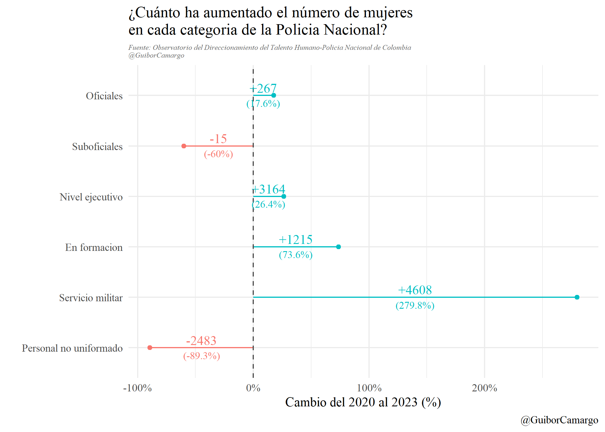

# Participación de la mujer en la Policia Nacional de Colombia

[\@GuiborCamargo](https://twitter.com/GuiborCamargo)

------------------------------------------------------------------------

🧵1/10 Participación de la 𝐦𝐮𝐣𝐞𝐫 en la @PoliciaColombia

Tesis común en redes es q las mujeres "naturalmente" no escojen carreras dominadas tradicionalmente x hombres: 𝐟𝐮𝐞𝐫𝐳𝐚𝐬 𝐩𝐨𝐥𝐢𝐜𝐢𝐚𝐥𝐞𝐬 entre estas ¿Q muestran los datos?

{width="252"}

Hoy de 100 policias 16 son mujeres

🧵2/10 𝐏𝐄𝐑𝐎 tambien hoy en día hay 6.754 mujeres más en la @PoliciaColombia q en el 2020 (un 34% más). Tambien se puede observar (a propósito tema aparte grave) una perdida de más de 14mil hombres en la fuerza policial del país.

{width="375"}

🧵3/10

Sumás mas, sumas menos, la participación de la mujer en la @PoliciaColombia aumento 5 putnos porcentuales en estos cuatro años, en una tendecnia continua.

{width="400"}

🧵4/10

𝐋𝐚 @PoliciaColombia 𝐬𝐞 𝐞𝐬𝐭𝐚 𝐭𝐫𝐚𝐧𝐬𝐟𝐨𝐫𝐦𝐚𝐧𝐝𝐨! y rápidamente!

Oficiales: 24% son mujeres y en aumento Suboficiales: 27% son mujeres y en aumento

Ademas, en las escuelas de formación, hoy en día el 43% de los estudiantes son futuras polcias!👮‍♀️

{width="600"}

🧵5/10

Es cierto q este aumento en la participación se ha dado tambien x una pérdida de personal masculino (𝗮𝗹𝗴𝗼 𝗮 𝗹𝗼 𝗾𝘂𝗲 𝗵𝗮𝘆 𝗾 𝗽𝗮𝗿𝗮𝗿 𝗯𝗼𝗹𝗮𝘀).Aun así, hay aumentos netos en oficiales, en el nivel ejectuvo, en las escuelas y en servicio militar (auxiliares)

{width="350"}

🧵6/10 Algunos estudios como el de Raganella, A. J, et al (2004), han señalado q las aptitudes no son diferntes entre hombres y mujeres; sugiriendo q la composición mayoritariametne masculina esta más más relacionada con los procesos de incorporación q a diferencias de género.

🧵7/10

Es muy pronto para saber los efectos de la liberación de espacios y oportunidades para la mujer en la composición del mercado laboral. Despues de todo son miles de años de una cultura q impone preferencias por género.

🧵8/10 Lo cierto hoy es q las mujeres se estan abriendo caminos en carreras antes exlusivas para los hombres en Colombia

¿Cúales serán (o son) los efectos de esto en la realción de la @PoliciaColombia con la sociedad y la política?

¿Cómo la institucón cambiara hacia adentro?

🧵9/10

Este es solo un pequeño ejercicio, pero creo que es interesante ver cómo cambiará la policia y su relación con la sociedad derivado de estos cambios.

Igual, como siempre, lo más importante es que la @PoliciaColombia siga avanzando en entregar más datos abiertos!!!

🧵10/10

👁️👁️:

Script y datos de este ejericio los puedes consultar en mi GitHub!

<https://github.com/Guibi1994/Twits_and_posts/tree/main/2023_02_25_Mujeres_policia>
